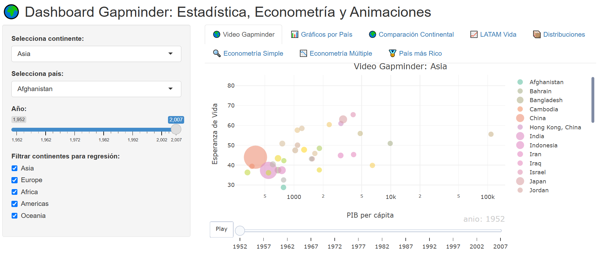

# ?? Dashboard Gapminder: Estadística, Econometría y Visualización

Este proyecto fue desarrollado en R con Shiny como parte del curso **Herramientas Informáticas I** de la **Maestría en Economía** en la Universidad Continental.

## ?? Objetivo

Explicar el desarrollo económico global integrando estadísticas, econometría y visualización interactiva, permitiendo el análisis comparativo por país y continente a través de un dashboard dinámico.

## ?? Integrantes

- Rafael Marcos Lapa Camargo – 41813100  
- Danilo Milenio Cueva Santos – 72102642  
- Paola Jessyca Bibians Jara Loayza – 71024879  
- Edison Marcavillaca Niño de Guzman – 43706021

## ?? Funcionalidades del Dashboard

- Comparación de esperanza de vida y PIB por país y continente  
- Análisis econométrico simple y múltiple  
- Gráficos interactivos y animados  
- Filtros por año, país y continente  

## ?? App publicada

[?? Ver app en ShinyApps.io](https://rlapac.shinyapps.io/herramientas_informticas_i-25mdtam002-psma-01043-2336-202501/)

## ?? Vista previa del Dashboard

## ?? Archivos incluidos

- `app.R`: Código fuente del dashboard  
- `Proyecto_Gapminder_Rafael_Lapa.pptx`: Presentación del proyecto  
- `bibliografia.md`: Fuentes bibliográficas consultadas  
- `dashboard_gapminder_demo.png`: Captura del dashboard  

## ????? Profesor

Prof. Joel Turco Quinto – Universidad Continental
